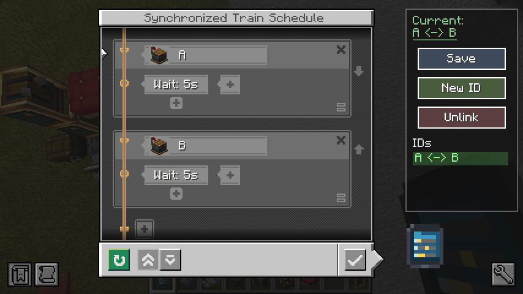

# Create Synchronized Train Schedule

This mod is an addon for [Create](https://github.com/Creators-of-Create/Create).

### License

This project is licensed under the MIT License.
See [LICENSE](LICENSE) for details.

The files under `docs/screenshots/` are excluded from the MIT License.

## 概要 (これしかないけど)

Create Modの列車時刻表を複数の列車で同期できるようにした、

Synchronized Train Scheduleアイテムを追加するModです。

追加アイテムはSynchronized Train Scheduleのみです。

JEI連携があり、JEIからレシピの検索ができ、JEIのGUIと競合しないようになっています。

---

## Overview

This mod adds a **Synchronized Train Schedule** item that allows train schedules in the Create Mod to be synchronized
across multiple trains.

The **Synchronized Train Schedule** is the only new item added by this mod.

The mod also includes JEI integration, allowing you to look up its recipe directly in JEI. The UI is designed to avoid
conflicts with JEI's interface, ensuring that JEI overlays and the Synchronized Trian Schedule screen do not overlap.

